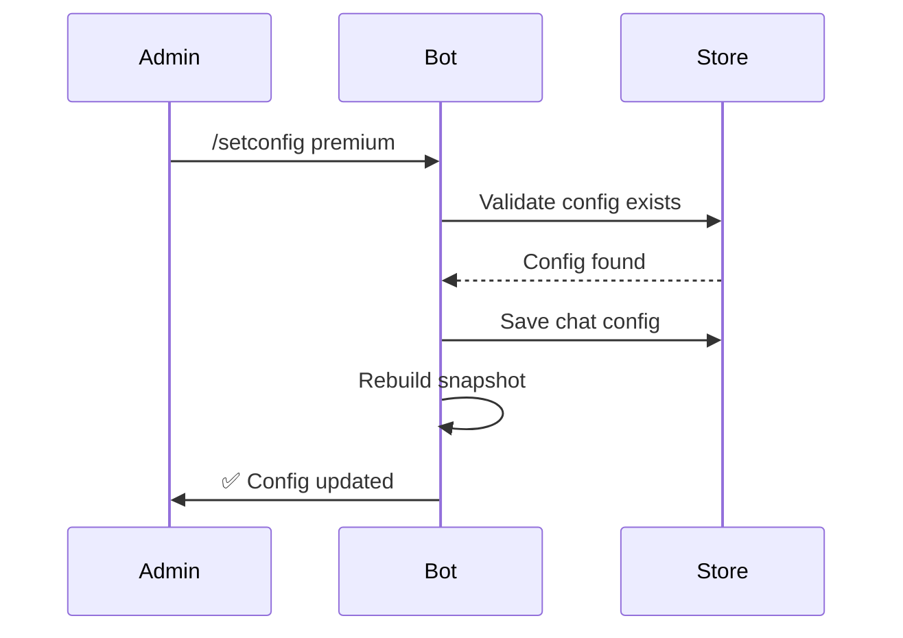
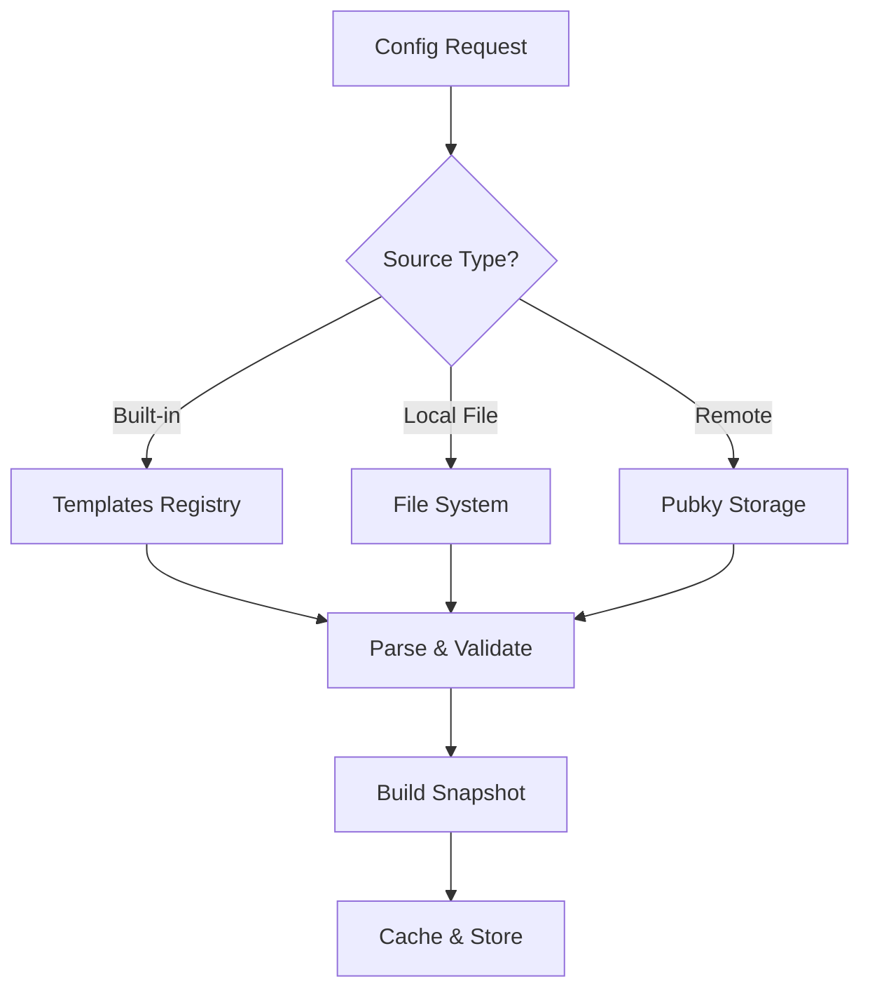

# Configuration Guide

This guide covers how to configure the Pubky Bot Builder, including environment variables, bot
configuration templates, and service settings.

## Environment Variables

Create a `.env.local` file (copy from `.env.example`):

```bash
cp .env.example .env.local
```

### Required Variables

| Variable    | Description                                                  |
| ----------- | ------------------------------------------------------------ |
| `BOT_TOKEN` | Telegram bot token from [@BotFather](https://t.me/BotFather) |

### Optional Variables

| Variable               | Default       | Description                                             |
| ---------------------- | ------------- | ------------------------------------------------------- |
| `NODE_ENV`             | `development` | Environment mode (`development` or `production`)        |
| `DEBUG`                | `0`           | Enable debug logging (`1` to enable)                    |
| `LOG_MIN_LEVEL`        | `info`        | Minimum log level: `debug`, `info`, `warn`, `error`     |
| `LOG_PRETTY`           | `0`           | Pretty-print JSON logs (`1` to enable)                  |
| `DEFAULT_TEMPLATE_ID`  | `default`     | Default configuration template ID                       |
| `WEBHOOK`              | `0`           | Use webhook mode instead of polling (`1` to enable)     |
| `ENABLE_DELETE_PINNED` | `0`           | Allow deleting pinned messages (`1` to enable)          |
| `DEFAULT_MESSAGE_TTL`  | `0`           | Auto-delete bot messages after N seconds (0 = disabled) |

## Bot Configuration Templates

Configuration templates define which services are available to the bot. The bot ships with a
`default` template, but you can create custom configurations.

### Template Structure

```json
{
	"configId": "my_custom_config",
	"services": [
		{
			"name": "Service Name",
			"command": "commandname",
			"kind": "single_command",
			"entry": "./path/to/service.ts",
			"version": "1.0.0",
			"config": {},
			"datasets": {}
		}
	],
	"listeners": []
}
```

### Configuration Fields

#### Top-Level Fields

| Field       | Required | Description                              |
| ----------- | -------- | ---------------------------------------- |
| `configId`  | Yes      | Unique identifier for this configuration |
| `services`  | Yes      | Array of command/flow services           |
| `listeners` | No       | Array of listener services               |

#### Service Definition Fields

| Field      | Required | Description                                                   |
| ---------- | -------- | ------------------------------------------------------------- |
| `name`     | Yes      | Human-readable service name                                   |
| `command`  | Yes      | Command trigger (without `/`)                                 |
| `kind`     | Yes      | Service type: `single_command`, `command_flow`, or `listener` |
| `entry`    | Yes      | Path to service TypeScript file                               |
| `version`  | No       | Service version string                                        |
| `config`   | No       | Custom configuration object passed to service                 |
| `datasets` | No       | Named dataset mappings (name → URL)                           |

### Example Configurations

#### Minimal Configuration

```json
{
	"configId": "minimal",
	"services": [
		{
			"name": "Simple Response",
			"command": "hello",
			"kind": "single_command",
			"entry": "./packages/core_services/simple-response/service.ts"
		}
	]
}
```

#### Full-Featured Configuration

```json
{
	"configId": "full_featured",
	"services": [
		{
			"name": "Simple Response",
			"command": "hello",
			"kind": "single_command",
			"entry": "./packages/core_services/simple-response/service.ts",
			"version": "1.0.0",
			"config": {
				"greeting": "Welcome to our bot!"
			}
		},
		{
			"name": "Help",
			"command": "help",
			"kind": "single_command",
			"entry": "./packages/core_services/help/service.ts",
			"version": "1.0.0"
		},
		{
			"name": "Resource Links",
			"command": "links",
			"kind": "single_command",
			"entry": "./packages/core_services/links/service.ts"
		}
	],
	"listeners": [
		{
			"name": "Trigger Words",
			"command": "triggerwords",
			"kind": "listener",
			"entry": "./packages/core_services/triggerwords/service.ts"
		}
	]
}
```

## Service Configuration

### Passing Config to Services

Configuration is available in the event context:

```typescript
// In your service
function handleCommand(ev: CommandEvent) {
	const config = ev.serviceConfig as MyConfigType;
	const value = config?.myOption ?? "default";
	// ...
}
```

### Configuration in Template

```json
{
	"name": "Configurable Service",
	"command": "myservice",
	"kind": "single_command",
	"entry": "./services/myservice/service.ts",
	"config": {
		"greeting": "Hello!",
		"maxRetries": 3,
		"features": {
			"enableLogging": true,
			"theme": "dark"
		}
	}
}
```

## Datasets

Datasets allow services to access external data. They're loaded at snapshot build time and passed to
services.

### Local Datasets

Place JSON files in a `datasets/` folder alongside your service:

```
my_service/
├── service.ts
├── constants.ts
└── datasets/
    ├── items.json
    └── categories.json
```

Datasets are auto-discovered and available via `ev.datasets`:

```typescript
function handleCommand(ev: CommandEvent) {
	const items = ev.datasets?.items as ItemData;
	// ...
}
```

### Remote Datasets (Pubky)

Reference datasets via Pubky URLs:

```json
{
	"name": "My Service",
	"command": "myservice",
	"kind": "single_command",
	"entry": "./services/myservice/service.ts",
	"config": {
		"datasets": {
			"products": "pubky://abc123.../pub/myapp/products.json"
		}
	}
}
```

## Per-Chat Configuration

Admins can change the bot configuration for specific chats using:

```
/setconfig <config_id>
```

The bot will:

1. Validate the config ID exists
2. Rebuild the routing snapshot
3. Update available commands
4. Persist the choice



## Built-in Templates

The bot includes these built-in templates:

### `default`

Standard configuration with core services:

- `/hello` - Simple response greeting
- `/help` - Help information
- `/links` - Categorized links
- Trigger words listener - Auto-responds to configured keywords

### Creating Custom Templates

1. Create a JSON file with your configuration
2. Reference it by path or upload to Pubky storage
3. Use `/setconfig <path_or_url>` to apply

## Admin Commands

These commands are available to chat administrators:

| Command           | Description                                |
| ----------------- | ------------------------------------------ |
| `/start`          | Initialize bot and show available commands |
| `/setconfig <id>` | Change bot configuration template          |
| `/updateconfig`   | Force refresh current configuration        |

## Configuration Sources

Configuration can be loaded from multiple sources:



### Built-in Templates

Use the template ID directly:

```
/setconfig default
```

### Pubky URLs

Reference remote configurations:

```
/setconfig pubky://abc123.../pub/botconfig/premium.json
```

## Snapshot Caching

The bot caches routing snapshots for performance:

1. **In-memory cache** - 10 second TTL
2. **SQLite persistence** - Keyed by config hash
3. **Integrity verification** - SHA-256 checksum

Force a refresh with:

```
/updateconfig
```

Or programmatically:

```typescript
await buildSnapshot(chatId, { force: true });
```

## Database Schema

Configuration is stored in SQLite:

```sql
-- Chat-specific configuration
CREATE TABLE chat_configs (
    chat_id TEXT PRIMARY KEY,
    config_id TEXT NOT NULL,
    updated_at INTEGER NOT NULL
);

-- Cached snapshots
CREATE TABLE snapshots (
    config_hash TEXT PRIMARY KEY,
    snapshot_json TEXT NOT NULL,
    created_at INTEGER NOT NULL
);

-- Service bundles (content-addressed)
CREATE TABLE bundles (
    bundle_hash TEXT PRIMARY KEY,
    data_url TEXT NOT NULL,
    code TEXT NOT NULL,
    created_at INTEGER NOT NULL
);
```

## Security Considerations

1. **Config validation** - All configurations are validated before use
2. **Sandbox isolation** - Services can't access config of other services
3. **Admin-only changes** - Only admins can modify chat configuration
4. **No secrets in config** - Never put API keys or tokens in service config

## Troubleshooting

### Config not loading

1. Check the config ID/URL is valid
2. Verify JSON syntax is correct
3. Check service entry paths exist
4. Review logs for errors: `LOG_MIN_LEVEL=debug deno task dev`

### Services not appearing

1. Ensure `kind` is valid (`single_command`, `command_flow`, `listener`)
2. Check `command` is unique and doesn't conflict
3. Verify `entry` path is accessible
4. Run `/start` to refresh command list

### State not persisting

1. Verify `kind` is `command_flow` (not `single_command`)
2. Ensure you're returning `state` in responses
3. Check the flow isn't being cleared prematurely
4. Different users have separate state
