# Pubky Bot Builder - Architecture Overview

This document provides an overview of the Pubky Bot Builder system architecture, how services work,
and how to configure and extend the bot.

## High-Level Architecture


## Complete Flow Example: Event Creator Service

The following diagram shows the complete data flow when a user creates an event using the Event Creator service, demonstrating how sandboxed services can safely publish to the decentralized Pubky network:

```mermaid
flowchart LR
    subgraph User["👤 User"]
        U[Telegram User]
    end
    
    subgraph TrustedHost["🔒 Trusted Host"]
        direction TB
        Bot[Bot/Router]
        Disp[Dispatcher]
        PW[PubkyWriter]
        DB[(SQLite)]
    end
    
    subgraph Sandbox["🔐 Sandbox<br/>(Zero Permissions)"]
        EC[Event Creator<br/>Service]
        SDK[SDK:<br/>state, reply,<br/>pubkyWrite]
        Eventky[eventky-specs:<br/>createEvent]
    end
    
    subgraph AdminFlow["👮 Admin Approval"]
        AG[Admin Group]
        Admin[Human Admin]
    end
    
    subgraph PubkyNetwork["🌐 Pubky Network"]
        HS[Homeserver]
    end
    
    U -->|1. /newevent| Bot
    Bot -->|2. Payload via stdin| EC
    EC --> SDK
    EC --> Eventky
    EC -->|3. Response via stdout| Disp
    Disp <-->|4. State| DB
    
    EC -.->|pubkyWrite| Disp
    Disp -->|5. Queue| PW
    PW -->|6. Preview| AG
    Admin -->|7. ✅ Approve| AG
    AG --> PW
    PW -->|8. Write| HS
    PW -->|9. Notify| U
```



**Flow Steps:**
1. User sends `/newevent` command
2. Dispatcher runs Event Creator in isolated sandbox
3. Service uses SDK to build multi-step flow, collects event data
4. State persists between steps via SQLite
5. On confirm, service returns `pubkyWrite()` response with event data
6. PubkyWriter queues write and forwards preview to admin group
7. Human admin reviews and approves the event
8. PubkyWriter executes `session.storage.putJson()` to Pubky homeserver
9. User receives confirmation message

## Core Components

### 1. Bot Entry Point (`src/bot.ts`, `src/main.ts`)

The bot initializes with grammY and connects to Telegram. It supports two modes:

- **Polling mode** (development): `deno task dev`
- **Webhook mode** (production): `deno task serve`

### 2. Router Middleware (`src/middleware/router.ts`)

Routes incoming Telegram updates to the appropriate handlers:

- `/start` - Initializes commands for the chat
- `/setconfig <id>` - Admin command to change bot configuration
- Service commands - Dispatched to the service sandbox

### 3. Dispatcher (`src/core/dispatch/dispatcher.ts`)

The dispatcher is the heart of the system. It:

1. Receives events (commands, callbacks, messages)
2. Looks up the appropriate service from the routing snapshot
3. Loads the service bundle
4. Executes the service in a sandboxed environment
5. Processes the response and manages state


### 4. Sandbox Host (`src/core/sandbox/host.ts`)

Services run in isolated Deno subprocesses with no permissions by default:

- No network access
- No file system access
- No remote module imports
- Timeout protection (max 20 seconds)

This ensures services cannot access sensitive data or cause harm.

### 5. PubkyWriter (`src/core/pubky/writer.ts`)

The PubkyWriter enables services to publish data to the Pubky decentralized network with admin approval:

```mermaid
sequenceDiagram
    autonumber
    participant U as User
    participant Bot as Bot/Dispatcher
    participant S as Sandbox Service
    participant PW as PubkyWriter
    participant DB as SQLite
    participant AG as Admin Group
    participant Admin as Human Admin
    participant Pubky as Pubky Homeserver
    
    Note over U,Pubky: Example: Event Creator Service Flow
    
    U->>Bot: /newevent
    Bot->>S: Run service (command event)
    S-->>Bot: reply("What's the title?", state)
    Bot->>U: "Step 1: What's the title?"
    
    loop Multi-step Flow
        U->>Bot: User input (title, date, time...)
        Bot->>S: Run service (message event + state)
        S-->>Bot: reply(prompt, merged state)
        Bot->>U: Next step prompt
    end
    
    U->>Bot: Clicks "✅ Submit" button
    Bot->>S: Run service (callback: confirm)
    S->>S: createEvent() via eventky-specs
    S-->>Bot: pubkyWrite(path, event, preview)
    
    Note over Bot,PW: Trust Boundary - Admin Approval Required
    
    Bot->>PW: queueWrite(path, data, preview)
    PW->>DB: Save pending write
    PW->>AG: Forward preview for approval
    AG->>Admin: "New event: [preview] ✅/❌"
    
    alt Approved
        Admin->>AG: Click ✅ Approve
        AG->>PW: approve(writeId)
        PW->>Pubky: session.storage.putJson()
        Pubky-->>PW: Success
        PW->>DB: Status: written
        PW->>U: "Your event has been published!"
    else Rejected
        Admin->>AG: Click ❌ Reject
        AG->>PW: reject(writeId)
        PW->>DB: Status: rejected
    end
```



**Key Security Features:**
- Services cannot directly write to Pubky (sandbox isolation)
- All writes require human admin approval
- Preview shown to admins before approval
- Writes are tracked in SQLite with full audit trail
- Timeout-based expiration for pending writes

### 6. Snapshot System (`src/core/snapshot/snapshot.ts`)

Snapshots are cached routing tables that map commands to service bundles:

- Built from configuration templates
- Cached in-memory with TTL
- Persisted to SQLite by config hash
- Includes integrity verification

## Service Types

Services are defined using the SDK and come in three types:

| Kind             | Description                      | Use Case                                    |
| ---------------- | -------------------------------- | ------------------------------------------- |
| `single_command` | Stateless, responds once         | Simple utilities, links, greetings          |
| `command_flow`   | Stateful, multi-step interaction | Surveys, wizards, forms                     |
| `listener`       | Responds to any message          | Auto-responders, bots that react to content |

### Service Lifecycle


## SDK Overview

The SDK (`packages/sdk/`) provides building blocks for services:

### Event Types

```typescript
// Command event - user invoked a bot command
type CommandEvent = { type: "command" } & ServiceContext;

// Callback event - user clicked an inline button
type CallbackEvent = { type: "callback"; data: string } & ServiceContext;

// Message event - user sent a message (text, photo, etc.)
type MessageEvent = { type: "message"; message: unknown } & ServiceContext;
```

### Service Context

Every event includes:

- `chatId` - Telegram chat identifier
- `userId` - Telegram user identifier
- `language` - User's language code
- `state` - Current service state (for flows)
- `serviceConfig` - Custom configuration from bot config
- `datasets` - Loaded dataset objects
- `routeMeta` - Service routing metadata

### Response Types

Services return one of these response types:

| Response               | Purpose                       |
| ---------------------- | ----------------------------- |
| `reply(text)`          | Send a new message            |
| `edit(text)`           | Edit the triggering message   |
| `photo(url)`           | Send a photo                  |
| `audio(url)`           | Send audio                    |
| `video(url)`           | Send video                    |
| `document(url)`        | Send a document               |
| `location(lat, lng)`   | Send a location               |
| `contact(phone, name)` | Send a contact                |
| `del()`                | Delete the triggering message |
| `none()`               | No response                   |
| `error(text)`          | Error response                |
| `uiKeyboard(kb)`       | UI keyboard response          |
| `uiMenu(menu)`         | UI menu response              |
| `uiCard(card)`         | UI card response              |
| `uiCarousel(items)`    | UI carousel response          |

### State Management

For `command_flow` services, state persists between interactions:

```typescript
import { state } from "@sdk/mod.ts";

// Replace entire state
state.replace({ step: 1, data: "value" });

// Merge with existing state
state.merge({ step: 2 });

// Clear state (ends flow)
state.clear();
```

### UI Builder

Cross-platform UI abstraction:

```typescript
import { UIBuilder } from "@sdk/mod.ts";

// Keyboard with callback buttons
const keyboard = UIBuilder.keyboard()
	.namespace("my_service") // Auto-prefix callbacks
	.callback("Option 1", "opt1")
	.row()
	.callback("Option 2", "opt2")
	.build();

// Menu grid
const menu = UIBuilder.menu("Select an option")
	.callback("A", "a")
	.callback("B", "b")
	.columns(2)
	.build();

// Card with image and actions
const card = UIBuilder.card("Title")
	.description("Description text")
	.image("https://example.com/image.jpg")
	.callback("Action", "action_data")
	.build();
```

## Creating a Service

### Minimal Example (single_command)

```typescript
// my_service/service.ts
import { defineService, none, reply, runService } from "@sdk/mod.ts";
import type { CommandEvent } from "@sdk/mod.ts";

const service = defineService({
	id: "my_service",
	version: "1.0.0",
	kind: "single_command",
	command: "mycommand",
	description: "Does something useful",
	handlers: {
		command: (ev: CommandEvent) => {
			return reply("Hello from my service!");
		},
		callback: () => none(),
		message: () => none(),
	},
});

export default service;
if (import.meta.main) await runService(service);
```

### Stateful Flow Example (command_flow)

```typescript
// wizard/service.ts
import { defineService, none, reply, runService, state } from "@sdk/mod.ts";
import type { CallbackEvent, CommandEvent, MessageEvent } from "@sdk/mod.ts";

interface WizardState {
	step: number;
	name?: string;
}

const service = defineService({
	id: "wizard",
	version: "1.0.0",
	kind: "command_flow",
	command: "wizard",
	handlers: {
		command: (ev: CommandEvent) => {
			return reply("What is your name?", {
				state: state.replace({ step: 1 }),
			});
		},
		message: (ev: MessageEvent) => {
			const st = ev.state as WizardState;
			if (st?.step === 1) {
				const name = (ev.message as { text?: string })?.text;
				return reply(`Nice to meet you, ${name}!`, {
					state: state.clear(), // End the flow
				});
			}
			return none();
		},
		callback: () => none(),
	},
});

export default service;
if (import.meta.main) await runService(service);
```

## Configuration

### Bot Configuration Template

Configuration defines which services are available:

```json
{
	"configId": "my_config",
	"services": [
		{
			"name": "Hello",
			"command": "hello",
			"kind": "single_command",
			"entry": "./packages/demo_services/hello/service.ts",
			"version": "1.0.0"
		},
		{
			"name": "Survey",
			"command": "survey",
			"kind": "command_flow",
			"entry": "./packages/demo_services/survey/service.ts",
			"config": {
				"custom_option": true
			}
		}
	],
	"listeners": []
}
```

### Service Configuration Options

| Field      | Required | Description                                     |
| ---------- | -------- | ----------------------------------------------- |
| `name`     | Yes      | Display name                                    |
| `command`  | Yes      | Command trigger (without `/`)                   |
| `kind`     | Yes      | `single_command`, `command_flow`, or `listener` |
| `entry`    | Yes      | Path to service file                            |
| `version`  | No       | Service version                                 |
| `config`   | No       | Custom config passed to service                 |
| `datasets` | No       | Named dataset mappings                          |

### Datasets

Services can access external data through datasets:

```json
{
	"name": "UI Demo",
	"command": "ui",
	"entry": "./packages/demo_services/ui_demo/service.ts",
	"config": {
		"datasets": {
			"carousel": "pubky://user/pub/app/datasets/carousel.json"
		}
	}
}
```

In the service, access via `ev.datasets.carousel`.

### Environment Variables

| Variable              | Default       | Description                           |
| --------------------- | ------------- | ------------------------------------- |
| `BOT_TOKEN`           | _required_    | Telegram bot token                    |
| `NODE_ENV`            | `development` | Environment mode                      |
| `DEBUG`               | `0`           | Enable debug mode                     |
| `LOG_MIN_LEVEL`       | `info`        | Logging level (debug/info/warn/error) |
| `LOG_PRETTY`          | `0`           | Pretty-print logs                     |
| `DEFAULT_TEMPLATE_ID` | `default`     | Default config template               |
| `WEBHOOK`             | `0`           | Enable webhook mode                   |
| `DEFAULT_MESSAGE_TTL` | `0`           | Auto-delete messages after N seconds  |

## Pubky Integration

The bot can fetch configurations and data from the Pubky decentralized storage network:


### Pubky URLs

- Format: `pubky://<public_key>/pub/<path>`
- Used for: Configuration files, datasets, media assets

## Security Model


Services run in complete isolation:

- No network access (`--no-remote`)
- No environment variables
- No file system access
- Communication only via stdin/stdout JSON
- Timeout enforcement

## File Structure

```
pubky_bot_builder_telegram/
├── src/
│   ├── bot.ts              # Bot initialization
│   ├── main.ts             # Entry point
│   ├── core/
│   │   ├── config.ts       # Environment config
│   │   ├── dispatch/       # Event dispatcher
│   │   ├── sandbox/        # Service sandbox
│   │   ├── snapshot/       # Routing snapshots
│   │   ├── state/          # State management
│   │   └── pubky/          # Pubky client
│   ├── middleware/
│   │   ├── router.ts       # Command routing
│   │   ├── admin.ts        # Admin checks
│   │   └── response.ts     # Response handling
│   └── adapters/
│       └── telegram/       # Telegram-specific adapters
├── packages/
│   ├── sdk/                # Service SDK
│   └── demo_services/      # Example services
└── docs/                   # Documentation
```

## Next Steps

- See [services.md](services.md) for detailed service development guide
- See [configuration.md](configuration.md) for advanced configuration options
- Check `packages/demo_services/` for working examples
