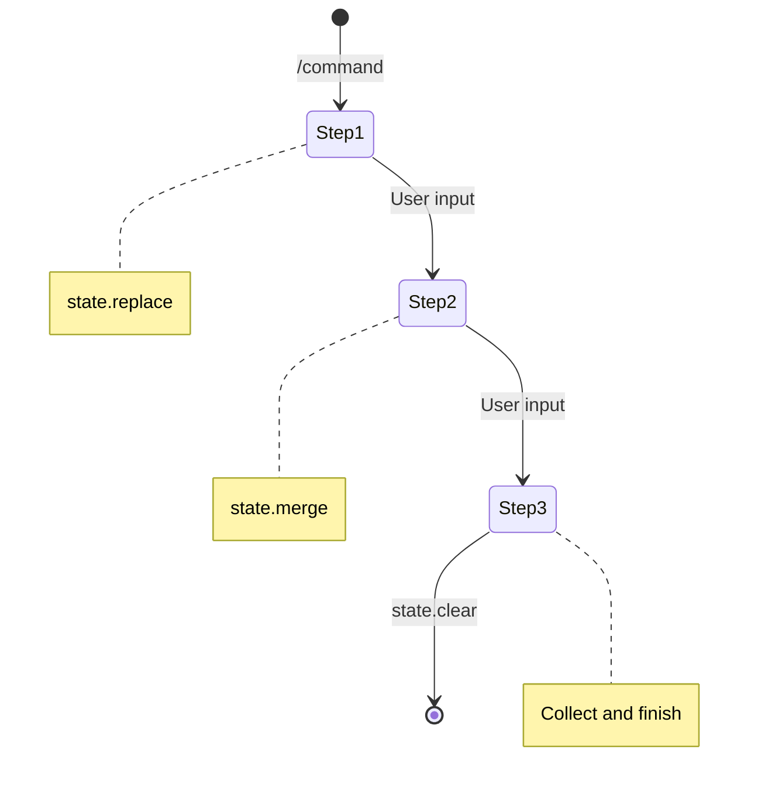

# Building Services

This guide covers how to create services for the Pubky Bot Builder.

## Service Fundamentals

A service is a self-contained module that handles specific bot functionality. Services are defined
using the SDK and run in isolated sandboxes for security.

### Service Definition Structure

```typescript
import { defineService, none, reply, runService } from "@sdk/mod.ts";
import type { CallbackEvent, CommandEvent, MessageEvent } from "@sdk/mod.ts";

const service = defineService({
	// Metadata
	id: "unique_service_id", // Optional - auto-generated if omitted
	version: "1.0.0", // Required
	kind: "single_command", // Required: service type
	command: "mycommand", // Optional - injected from config if omitted
	description: "What this does", // Optional

	// Event handlers (all required, return none() if not used)
	handlers: {
		command: (ev: CommandEvent) => {/* ... */},
		callback: (ev: CallbackEvent) => {/* ... */},
		message: (ev: MessageEvent) => {/* ... */},
	},
});

export default service;

// Required for sandbox execution
if (import.meta.main) await runService(service);
```

## Service Kinds

### single_command

Stateless services that respond once per invocation.

**Best for:** Utilities, information display, simple actions

```typescript
const service = defineService({
	id: "ping",
	version: "1.0.0",
	kind: "single_command",
	command: "ping",
	handlers: {
		command: () => reply("Pong! 🏓"),
		callback: () => none(),
		message: () => none(),
	},
});
```

### command_flow

Stateful services that maintain conversation state across multiple interactions.

**Best for:** Surveys, wizards, forms, multi-step processes



```typescript
interface FormState {
	step: number;
	email?: string;
	name?: string;
}

const service = defineService({
	id: "signup",
	version: "1.0.0",
	kind: "command_flow",
	command: "signup",
	handlers: {
		command: () =>
			reply("Enter your email:", {
				state: state.replace({ step: 1 }),
			}),
		message: (ev: MessageEvent) => {
			const st = ev.state as FormState;
			const text = (ev.message as { text?: string })?.text ?? "";

			if (st?.step === 1) {
				return reply("Enter your name:", {
					state: state.merge({ step: 2, email: text }),
				});
			}
			if (st?.step === 2) {
				return reply(`Signed up: ${text} (${st.email})`, {
					state: state.clear(), // End flow
				});
			}
			return none();
		},
		callback: () => none(),
	},
});
```

### listener

Services that respond to any message in the chat (not just commands).

**Best for:** Auto-responders, keyword detection, content moderation

```typescript
const service = defineService({
	id: "echo",
	version: "1.0.0",
	kind: "listener",
	handlers: {
		message: (ev: MessageEvent) => {
			const text = (ev.message as { text?: string })?.text;
			if (text?.includes("hello")) {
				return reply("Hello back!");
			}
			return none();
		},
		command: () => none(),
		callback: () => none(),
	},
});
```

## Response Types

### Text Responses

```typescript
import { edit, error, reply } from "@sdk/mod.ts";

// Send new message
reply("Hello, world!");

// Edit triggering message (for callbacks)
edit("Updated content");

// Error response
error("Something went wrong");

// With options
reply("Formatted *text*", {
	options: { parse_mode: "Markdown" },
});
```

### Media Responses

```typescript
import { audio, contact, document, location, photo, video } from "@sdk/mod.ts";

// Photo (URL, file_id, or pubky:// URL)
photo("https://example.com/image.jpg", { caption: "Nice photo!" });

// Audio
audio("https://example.com/song.mp3", {
	title: "Song Title",
	performer: "Artist",
	duration: 180,
});

// Video
video("https://example.com/video.mp4", {
	duration: 120,
	width: 1920,
	height: 1080,
});

// Document
document("https://example.com/file.pdf", {
	filename: "report.pdf",
});

// Location
location(51.5074, -0.1278, {
	title: "London",
	address: "United Kingdom",
});

// Contact
contact("+1234567890", "John", { lastName: "Doe" });
```

### Control Responses

```typescript
import { del, none } from "@sdk/mod.ts";

// Delete triggering message
del();

// No response (silent)
none();
```

### UI Responses

```typescript
import { UIBuilder, uiCard, uiCarousel, uiKeyboard, uiMenu } from "@sdk/mod.ts";

// Keyboard
const kb = UIBuilder.keyboard()
	.namespace("my_service")
	.callback("Button 1", "action1")
	.row()
	.callback("Button 2", "action2")
	.build();
uiKeyboard(kb, "Choose an option:");

// Menu (auto-arranged grid)
const menu = UIBuilder.menu("Select")
	.callback("A", "a")
	.callback("B", "b")
	.callback("C", "c")
	.columns(3)
	.build();
uiMenu(menu, "Pick one:");

// Card
const card = UIBuilder.card("Product")
	.description("A great product")
	.image("https://example.com/product.jpg")
	.callback("Buy", "buy")
	.callback("Details", "details")
	.build();
uiCard(card);

// Carousel
const carousel = UIBuilder.carousel()
	.addCard(UIBuilder.card("Item 1").description("First"))
	.addCard(UIBuilder.card("Item 2").description("Second"))
	.navigation(true)
	.build();
uiCarousel(carousel);
```

## Response Options

All responses support these options:

```typescript
reply("Message", {
	// Telegram-specific options
	options: {
		parse_mode: "Markdown", // or "HTML"
		reply_markup: keyboard, // Inline keyboard
		disable_notification: true, // Silent message
	},

	// State management (for command_flow)
	state: state.replace({ step: 1 }),

	// Delete the message that triggered this response
	deleteTrigger: true,

	// Auto-delete this response after N seconds
	ttl: 30,
});
```

## State Management

### State Operations

```typescript
import { state } from "@sdk/mod.ts";

// Replace entire state
state.replace({ step: 1, data: "new" });

// Merge with existing state
state.merge({ step: 2 }); // Keeps existing fields

// Clear state (ends flow)
state.clear();
```

### Reading State

```typescript
function handleMessage(ev: MessageEvent) {
	// State is available in ev.state
	const st = ev.state as MyStateType;

	// State version tracks changes
	const version = ev.stateVersion;

	// ...
}
```

## Callback Data Format

Callbacks use a namespaced format: `svc:<serviceId>|<payload>`

### Automatic Namespacing

```typescript
const keyboard = UIBuilder.keyboard()
	.namespace("my_service") // Set namespace
	.callback("Click", "action") // data = "svc:my_service|action"
	.build();
```

### Manual Namespacing

```typescript
import { inlineKeyboard } from "@sdk/mod.ts";

const kb = inlineKeyboard()
	.button({ text: "Click", data: "svc:my_service|action" })
	.build();
```

### Parsing Callback Data

```typescript
function handleCallback(ev: CallbackEvent) {
	// ev.data contains just the payload (after the |)
	// The dispatcher already stripped the "svc:serviceId|" prefix

	if (ev.data === "action") {
		return reply("Action triggered!");
	}

	if (ev.data.startsWith("item:")) {
		const itemId = ev.data.split(":")[1];
		return reply(`Selected item: ${itemId}`);
	}

	return none();
}
```

## Accessing Configuration

### Service Config

```typescript
interface MyConfig {
	greeting: string;
	maxItems: number;
}

function handleCommand(ev: CommandEvent) {
	const config = ev.serviceConfig as MyConfig;
	const greeting = config?.greeting ?? "Hello";

	return reply(greeting);
}
```

### Datasets

```typescript
interface CarouselData {
	items: Array<{ title: string; image: string }>;
}

function handleCommand(ev: CommandEvent) {
	// datasets are pre-loaded JSON objects
	const data = ev.datasets?.carousel as CarouselData;

	if (!data?.items) {
		return error("Dataset not available");
	}

	// Use the data...
}
```

### Route Metadata

```typescript
function handleCommand(ev: CommandEvent) {
	// Access service metadata
	const { id, command, description } = ev.routeMeta ?? {};

	return reply(`Service: ${id}, Command: /${command}`);
}
```

## Internationalization (i18n)

```typescript
import { createI18n } from "@sdk/mod.ts";

const messages = {
	en: {
		greeting: "Hello, {{name}}!",
		farewell: "Goodbye!",
	},
	es: {
		greeting: "¡Hola, {{name}}!",
		farewell: "¡Adiós!",
	},
};

function handleCommand(ev: CommandEvent) {
	const t = createI18n(messages, ev.language);

	return reply(t("greeting", { name: "User" }));
	// Output: "Hello, User!" or "¡Hola, User!" based on language
}
```

## Working with Telegram Message Types

### Text Messages

```typescript
function handleMessage(ev: MessageEvent) {
	const msg = ev.message as { text?: string };
	const text = msg.text ?? "";

	return reply(`You said: ${text}`);
}
```

### Photos

```typescript
interface PhotoSize {
	file_id: string;
	width: number;
	height: number;
}

function handleMessage(ev: MessageEvent) {
	const msg = ev.message as { photo?: PhotoSize[] };

	if (msg.photo?.length) {
		// Get largest photo
		const largest = msg.photo[msg.photo.length - 1];
		return reply(`Photo received: ${largest.file_id}`);
	}

	return none();
}
```

### Documents

```typescript
interface Document {
	file_id: string;
	file_name?: string;
	mime_type?: string;
}

function handleMessage(ev: MessageEvent) {
	const msg = ev.message as { document?: Document };

	if (msg.document) {
		return reply(`Document: ${msg.document.file_name}`);
	}

	return none();
}
```

## Complete Example: Quiz Service

```typescript
// quiz/service.ts
import { defineService, none, reply, runService, state, UIBuilder, uiKeyboard } from "@sdk/mod.ts";
import type { CallbackEvent, CommandEvent } from "@sdk/mod.ts";

interface QuizState {
	questionIndex: number;
	score: number;
}

const questions = [
	{ q: "What is 2+2?", answers: ["3", "4", "5"], correct: 1 },
	{ q: "Capital of France?", answers: ["London", "Berlin", "Paris"], correct: 2 },
	{ q: "Largest planet?", answers: ["Jupiter", "Saturn", "Mars"], correct: 0 },
];

function showQuestion(index: number, score: number) {
	if (index >= questions.length) {
		return reply(`Quiz complete! Score: ${score}/${questions.length}`, {
			state: state.clear(),
		});
	}

	const q = questions[index];
	const kb = UIBuilder.keyboard()
		.namespace("quiz");

	q.answers.forEach((answer, i) => {
		kb.callback(answer, `answer:${i}`).row();
	});

	return uiKeyboard(kb.build(), `Q${index + 1}: ${q.q}`, {
		state: state.replace({ questionIndex: index, score }),
		deleteTrigger: true,
	});
}

const service = defineService({
	id: "quiz",
	version: "1.0.0",
	kind: "command_flow",
	command: "quiz",
	description: "A simple quiz game",
	handlers: {
		command: () => showQuestion(0, 0),
		callback: (ev: CallbackEvent) => {
			const st = ev.state as QuizState;
			if (!ev.data.startsWith("answer:")) return none();

			const answerIndex = parseInt(ev.data.split(":")[1]);
			const correct = questions[st.questionIndex].correct;
			const newScore = st.score + (answerIndex === correct ? 1 : 0);

			return showQuestion(st.questionIndex + 1, newScore);
		},
		message: () => none(),
	},
});

export default service;
if (import.meta.main) await runService(service);
```

## Testing Services

Services can be unit tested by calling handlers directly:

```typescript
// quiz/service_test.ts
import { assertEquals } from "jsr:@std/assert";
import service from "./service.ts";

Deno.test("quiz starts with first question", () => {
	const response = service.handlers.command({
		type: "command",
		chatId: "123",
		userId: "456",
	});

	assertEquals(response.kind, "ui");
	assertEquals(response.uiType, "keyboard");
});

Deno.test("quiz tracks score", () => {
	const response = service.handlers.callback({
		type: "callback",
		data: "answer:1", // Correct answer for Q1
		chatId: "123",
		userId: "456",
		state: { questionIndex: 0, score: 0 },
	});

	// Should advance to next question with score=1
	assertEquals(response.state?.op, "replace");
});
```

## Best Practices

1. **Always return a response** - Use `none()` for silent handlers
2. **Clear state when done** - Don't leave flows hanging
3. **Validate input** - Don't trust message content
4. **Use namespaces** - Prevent callback collisions
5. **Handle edge cases** - Missing state, invalid data
6. **Keep services focused** - One purpose per service
7. **Use i18n** - Support multiple languages
8. **Add descriptions** - Help users understand commands
